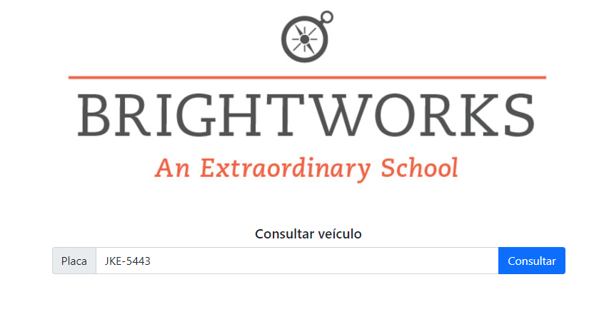

# desafioEverestSchool
Desafio proposto pelo mestre, Thadeu Soares: (github.com/thadeusoares). A aplicação recebe como parâmetro a placa de um veículo e retorna as informações relacionadas.
 

   
  

 
  "Atualmente a coordenação do INFANTIL precisa resolver um problema em relação aos veiculos
que chegam para buscar as crianças. Atualmente o colégio possui um sistema que possui
estes dados, porém não há uma forma de pesquisar essa informação no momento que os
responsáveis chegam para buscar a criança.
Neste sentido, o departamento de inovação propôs a criação de um aplicativo para que essa
consulta aconteça online. A ideia original seria tirar uma foto da placa do carro, identificar os
caracteres ali presentes e realizar a consulta no banco de dados, após isso, o aplicativo
apresentaria as informações do responsável e do aluno com sua foto. Devido ao tempo, a
funcionalidade de leitura de placa poderia ser substituída pela digitação do número da placa."

